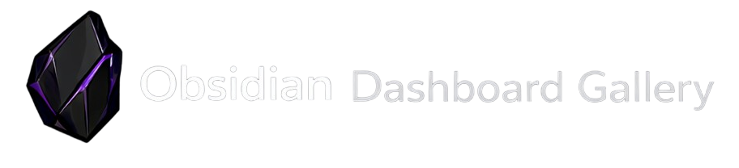
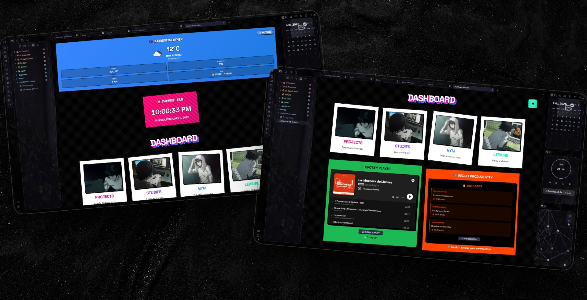
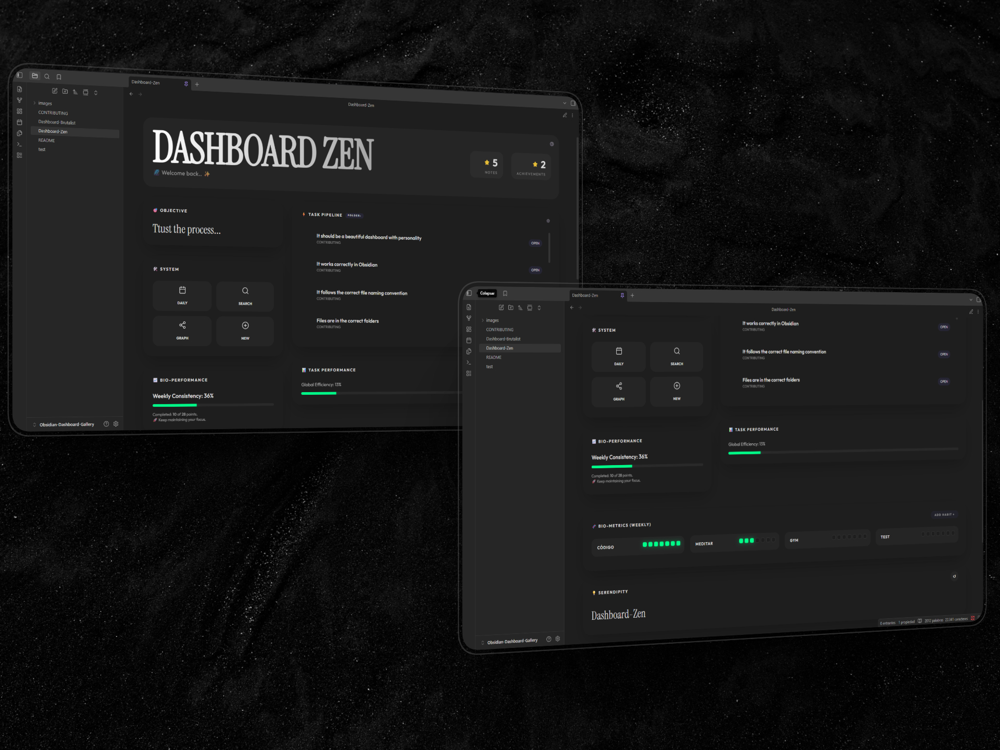
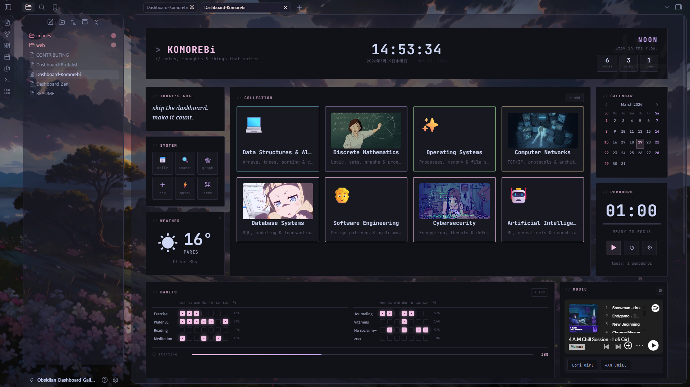

 

# Obsidian Dashboard Gallery 

 

[🇬🇧 English](../README.md) &nbsp;|&nbsp; [🇪🇸 **Español**] &nbsp;|&nbsp; [🇧🇷 Português](./README_pt.md) &nbsp;|&nbsp; [🇨🇳 简体中文](./README_zh.md) &nbsp;|&nbsp; [🌐 Web](https://obsidian.inlitx.xyz)

**Dashboards hermosos y listos para usar en tu bóveda de Obsidian**

---

## 🎨 ¡Bienvenido a la Galería de Dashboards!

Este repositorio está dedicado a compartir dashboards de Obsidian hermosos y funcionales que puedes usar fácilmente en tu propia bóveda.

**¿Qué tan simple es?** ¡Simplemente clona este repositorio, elige el dashboard que te guste, y copia tanto el archivo `.md` como su archivo `.css` correspondiente a tu bóveda de Obsidian. ¡Eso es todo! No necesitas configuración compleja ni conocimientos avanzados.

---

## 📋 Tabla de Contenidos

- [1. 💻 Dashboard Inicio Brutalista](#1--brutalist-home-dashboard)
- [2. 🧘 Dashboard Inicio Zen](#2--zen-home-dashboard)
- [3. 🌿 Dashboard Inicio Komorebi](#3--komorebi-home-dashboard)

---

## 1. 💻 Dashboard Inicio Brutalista

<strong>Autor:</strong> <a href="https://github.com/Inlitx">Inlitx</a>

Un dashboard de estilo brutalista con colores vibrantes, widget del clima, reloj y tarjetas interactivas. Perfecto para usuarios que quieren una página de inicio moderna y con personalidad.

**Plugins requeridos:**
· Dataview (con JavaScript habilitado)

**API requerida:**
· [OpenWeatherMap](https://openweathermap.org/api) (se necesita una clave API gratuita para el widget del clima)

🎥 Haz clic para ver la vista previa en video

---

## 2. 🧘 Dashboard Inicio Zen

<strong>Autor:</strong> <a href="https://github.com/Inlitx">Inlitx</a>

Un dashboard de productividad minimalista y premium con estética glassmorphism, seguimiento de hábitos, pipeline de tareas con scroll y personalización completa del banner. Diseñado para sentirse como un OS personal — limpio, rápido y hermoso.

**Plugins requeridos:**
· Dataview (con JavaScript habilitado)

🎥 Haz clic para ver la vista previa en video

---

## 3. 🌿 Dashboard Inicio Komorebi

<strong>Autor:</strong> <a href="https://github.com/Inlitx">Inlitx</a>

Un dashboard inspirado en la naturaleza con una estética suave y orgánica. Diseño limpio, paleta de colores tranquila y detalles sutiles, pensado para quienes buscan un espacio de trabajo sereno y sin distracciones.

**Plugins requeridos:**
· Dataview (con JavaScript habilitado)
· QuickAdd *(opcional)*

**API requerida:**
· [OpenWeatherMap](https://openweathermap.org/api) (se necesita una clave API gratuita para el widget del clima)

🎥 Haz clic para ver la vista previa en video

---

## 🚀 ¡Próximamente más dashboards!

Pronto subiré más dashboards con diferentes estilos y funcionalidades. ¡Mantente atento!

---

**⭐ ¡Apoya este proyecto de la manera que puedas!**

Hecho con ❤️ para la comunidad de Obsidian

---
